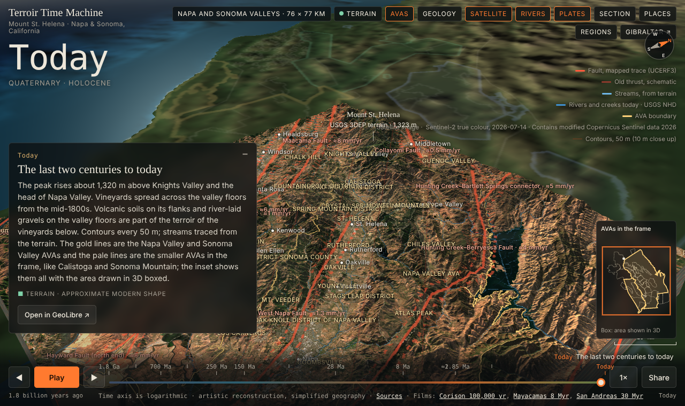
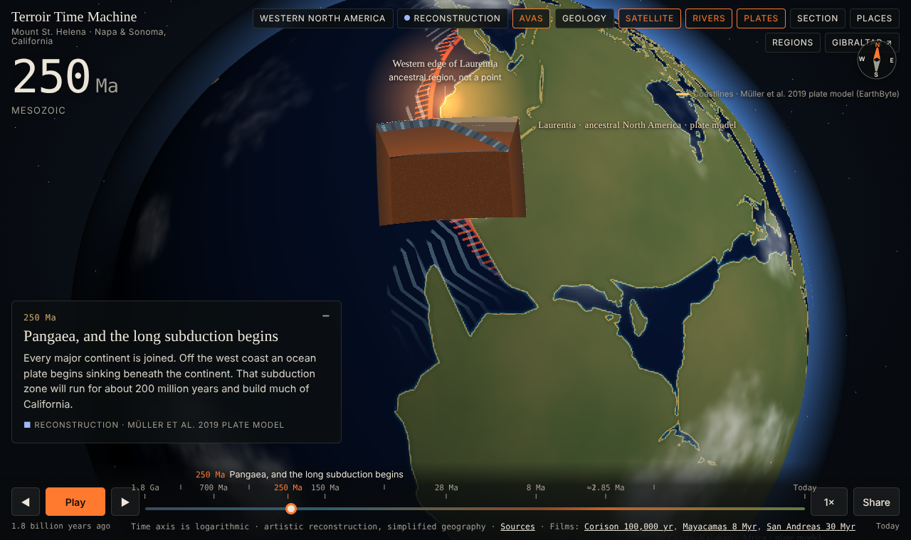

# Terroir Time Machine

Why does a Napa Cabernet taste of the place it grew? Part of the answer is buried: old seafloor scraped onto
the continent, volcanoes that erupted and collapsed, rivers that spread gravel across the valley floor. The
Terroir Time Machine lets you travel 1.8 billion years through the ground under Napa and Sonoma wine country,
from drifting continents on a spinning globe down to the soils, rivers and weather of individual vineyards
today. It runs in any modern web browser, with nothing to install.

**Open it: https://chachee1234.github.io/terroir-time-machine/**





## What you can do

- **Travel through time.** Press Play, drag the timeline, or step chapter by chapter from 1.8 billion years
  ago to today. The time axis is logarithmic, so the recent past gets the room it needs.
- **Watch the planet, then land.** Deep time is shown on a globe with moving continents (Müller et al. 2019
  plate model back to 410 million years). Around 28 million years ago the view dives to the ground.
- **Explore regions.** Open the Regions view to see which wine regions are mapped and fly into one.
- **Zoom into close-ups.** Every American Viticultural Area (AVA) in a mapped frame has a sharper close-up,
  down to 10 m terrain and satellite imagery.
- **Read the geology.** Drape the USGS geologic map, show mapped faults with their slip rates, and click
  anywhere for a cross-section of the layers underneath.
- **See the climate.** Climate normals for each AVA, and (where the data is published) a day-by-day
  weather map from 1981 to recent days.
- **Watch the animations.** Short films: the Corison vineyard over the last 100,000 years, the Mayacamas
  over 8 million years, and the San Andreas system over 30 million years. There is also a bonus
  chapter on the flood that refilled the Mediterranean through the Strait of Gibraltar.
- **Share a moment.** The Share button copies a link that reopens the same age, close-up and camera.

## Regions available

| Region | What is there |
|---|---|
| Napa and Sonoma valleys | The main 76 × 77 km frame with 26 AVA close-ups, geology, faults, rivers, satellite imagery, the Corison vineyard site |
| Petaluma Gap | Its own frame with AVA outlines and faults |
| Northern Sonoma | Alexander Valley, Dry Creek Valley, Russian River Valley and neighbours |
| West Sonoma Coast | Fort Ross-Seaview and the coastal ridges |
| Mount St. Helena | The original single-mountain block (`?region=mt_st_helena`) |
| Strait of Gibraltar | A separate story: the Messinian salinity crisis and the Zanclean flood |

Mendocino is being mapped now. After that the plan is Anderson Valley, the rest of Northern California and
then Southern California's wine regions.

**Want a region?** [Open an issue](https://github.com/chachee1234/terroir-time-machine/issues/new) with
the region's name and why it interests you. Requests are read and queued by hand.

## Stylized vs measured

Every chapter card carries a small coloured label that says how much of what you see is measured and how
much is drawn, and the Sources page gives each layer a kind in the same spirit. It is there so a pretty
picture is never mistaken for data.

| Label | Meaning |
|---|---|
| **Terrain · approximate modern shape** (green) | Built from measured data, such as USGS elevation and Sentinel-2 satellite images, simplified to fit the screen |
| **Mapped** (Sources page) | Lines from published maps, such as faults, AVA boundaries and rivers; accurate to the source map's scale |
| **Reconstruction · stylized** (blue) | Positions from a scientific model or hand-built keyframes that follow published reconstructions; the shapes are approximate |
| **Illustration · process shown, shape invented** (amber) | Shows how a process works, like a volcano growing or a river cutting down; the exact shape and size are not known |

The Sources page in the viewer (`prototype/sources.html`) lists each layer with its source, licence, detail
and kind (measured, mapped, stylized or illustration).

## Run it on your computer

You need Python 3 (already installed on most Macs and Linux machines). In a terminal:

```
git clone https://github.com/chachee1234/terroir-time-machine.git
cd terroir-time-machine
python3 -m http.server 8000
```

Then open http://localhost:8000/prototype/timemachine.html in your browser. Run the server from the repository
root (not from `prototype/`), because the viewer also reads `SCENES.json` and `data/` from the root.

## Data sources and credits

Everything shown comes from open sources, each recorded with its licence and the credit it asks for in
[SOURCES.md](SOURCES.md). The main ones:

- **Terrain:** USGS 3D Elevation Program, through AWS Open Data Terrain Tiles (Tilezen). Public domain.
- **Satellite:** Copernicus Sentinel-2. Contains modified Copernicus Sentinel data 2026.
- **Geology:** Graymer et al. 2007, USGS Scientific Investigations Map 2956. Public domain.
- **Faults:** GEM Global Active Faults Database (Styron & Pagani 2020), with California traces from USGS
  UCERF3. CC BY-SA 4.0.
- **Rivers:** USGS National Hydrography Dataset. Public domain.
- **AVA boundaries:** UC Davis Library AVA Project. CC0.
- **Soils:** USDA NRCS SSURGO and Official Series Descriptions. Public domain.
- **Vineyards:** USDA NASS Cropland Data Layer. Public domain.
- **Climate and daily weather:** PRISM Climate Group, Oregon State University.
- **Plate motion:** Müller et al. 2019 and Young et al. 2019 (EarthByte), CC BY 3.0.
- **3D engine:** three.js (MIT).

The geology and history in each chapter cite their papers in SOURCES.md.

## Licence

- Code: MIT, see [LICENSE](LICENSE).
- Chapter text and documentation: CC BY 4.0, see [LICENSE-CONTENT.md](LICENSE-CONTENT.md).
- Datasets keep their own licences, listed in [SOURCES.md](SOURCES.md).

## How to contribute

- **Found a mistake or have an idea?** [Open an issue](https://github.com/chachee1234/terroir-time-machine/issues/new).
  Corrections to the science are especially welcome; please include a source.
- **Code changes:** open a pull request. Every pull request runs automatic checks (unit tests, lint, a
  security pass and browser tests); [tests/README.md](tests/README.md) explains how to run them yourself.
- **Science rules:** [SCIENCE_RULES.md](SCIENCE_RULES.md) says what may be shown as fact and what must be
  labelled as illustration. Nothing is added without a source.

## Project status

A working prototype, updated often. New regions are added step by step, each one reviewed before it goes
live. Progress notes are in [status/](status/), and the plan is in [ROADMAP.md](ROADMAP.md) and
[ROADMAP_REGIONS.md](ROADMAP_REGIONS.md).
